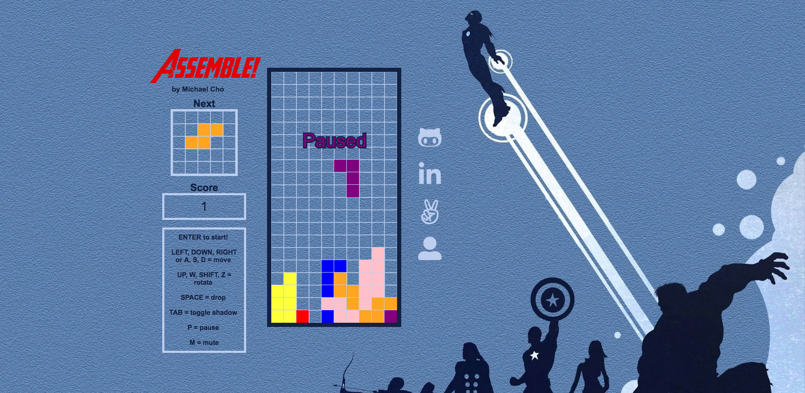

# Assemble!

## Live: [Assemble!](https://michaelhcho.com/Assemble/ "Assemble")

Assemble is a simple browser game based on Tetris, where the pieces are the colors of the Avengers. A user can control the falling piece and rotate it to find the perfect spot to clear rows. If the pieces stack to the top, the game is over.



# Feature highlights

## Rotating

Each piece is a matrix composed of non-zero values where the piece is colored and zero values where the piece is not. This allows for relatively straightforward rotation of the piece by transposing the matrix using parallel assignment, followed by reversing the rows of the matrix.

```javascript
transpose(matrix) {
  for (let y = 0; y < matrix.length; y++) {
    for (let x = 0; x < y; x++) {
      [matrix[x][y], matrix[y][x]] = [matrix[y][x], matrix[x][y]];
    }
  }

  matrix.reverse();
}
```

## Next Piece

The next piece is rendered on a separate `<canvas>` element and is accomplished through the use of a queue, following the `FIFO (First In First Out)` principle. The first piece in the `nextPieceArray` is taken and generated at the top of the board as the active piece, and the randomized next piece is generated and pushed onto the `nextPieceArray`.

```javascript
generateNextPiece() {
  const shape = SHAPES[
    Math.floor(SHAPES.length * Math.random())
  ];

  nextPieceArray.push(
    createPiece(shape)
  );

  activePiece = nextPieceArray.shift();
}
```

## Clearing Rows

Once a row is completely filled with pieces, it is cleared from the board. This is accomplished by iterating through the rows of the board from the bottom and checking if all of that row's elements are non-zero values. This row is then removed from the board and a new empty row is put at the top of the board. The number of rows cleared is also tracked and displayed as the user's score.

```javascript
clearRows() {
  let rowsCleared = 0;

  for (let y = board.length - 1; y > 0; y--) {
    for (let x = 0; x < board[y].length; x++) {
      if (board[y].every(el => el !== 0)) {
        board.splice(y);
        board.unshift(new Array(10).fill(0));

        rowsCleared += 1;
      }
    }
  }

  score += rowsCleared;
}
```

# Technologies

Development technologies for `Assemble!` include HTML5 Canvas and vanilla Javascript.

# Future Implementations

* Another canvas to render a piece to be held.
* A preview of the position the active piece would be if it was dropped.